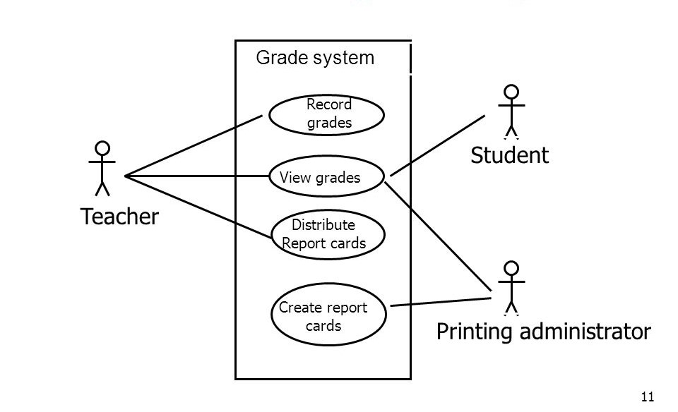

# Exam Management System
An assisting system in assessing students assessment that could be used by the following users: Teachers, Students, and Printing Administrator.

## Table of contents
* [General info](#exam-management-system)
* [Organization](#organization)
* [Technologies](#technologies)
* [Who has access?](#who-has-access)

## Organization
 Ateneo de Davao University - Computer Studies

## Technologies
We are going to use the MEVN stack for this system that stand for: 
* MongoDB 
* Express 
* VueJS
* NodeJS

## Who has access?
| User                   | Record Grades | View Grades  | Distribute Cards | Create Cards |
| -----------------------|:-------------:|:------------:|:----------------:|:------------:|
| Student                | |✓| | |
| Teacher                |✓|✓|✓| |
| Printing Administrator | |✓| |✓|

## Purpose/Details of the system

The aim of the system is to assist the users with their needs, like allowing the students to view their grades after the teacher submitted their grades to the printing administrator, after then it would be given to the teachers who would distribute the report cards to the respective students. As you can see in the table that I provided that it has a clean system that has been working for so long, the Teacher together with the Printing Administrator, they help each other with the students assessment, and the student only has the access to view their grades right after the process that the Teacher and Admin has gone through.

## Sub-System
* Teacher - has access to Record the grades of their students, in addition could also View the Grades. After recording the grades the printing admin could now have access to the grades that would be needed to be printed.
* Printing Administrator - has access to the recorded grades of the students in order to print them and would be given to the teachers after being printed.
* Student - only has access to view their grades after the teacher distrubuted their grades to them that was printed by the administrator.

